# Voice Sandwich Demo 🥪

A real-time, voice-to-voice AI pipeline demo featuring a sandwich shop order assistant. **Migrated to use ElevenLabs for both Speech-to-Text (STT) & Text-to-Speech (TTS), and Google Gemini for the Agent.**

## Architecture

The pipeline processes audio through three transform stages using async generators with a producer-consumer pattern:

```mermaid
flowchart LR
    subgraph Client [Browser]
        Mic[🎤 Microphone] -->|PCM Audio| WS_Out[WebSocket]
        WS_In[WebSocket] -->|Audio + Events| Speaker[🔊 Speaker]
    end

    subgraph Server [Python]
        WS_Receiver[WS Receiver] --> Pipeline

        subgraph Pipeline [Voice Agent Pipeline]
            direction LR
            STT[ElevenLabs STT] -->|Transcripts| Agent[Google Gemini Agent]
            Agent -->|Text Chunks| TTS[ElevenLabs TTS]
        end

        Pipeline -->|Events| WS_Sender[WS Sender]
    end

    WS_Out --> WS_Receiver
    WS_Sender --> WS_In
```



### Pipeline Stages

1. **STT Stage** (`_stt_stream`): Streams audio to **ElevenLabs Scribe**, yields transcription events (`stt_chunk`, `stt_output`).
2. **Agent Stage** (`_agent_stream`): Invokes **Google Gemini** agent on final transcripts, yields agent responses (`agent_chunk`, `tool_call`, `tool_result`, `agent_end`).
3. **TTS Stage** (`_tts_stream`): Sends agent text to **ElevenLabs TTS**, yields audio events (`tts_chunk`).

### Additional Features

#### Long-term Memory
The agent persists user preferences using a local SQLite database (`voice_agent.db`). This allows the agent to remember details like dietary restrictions across sessions.

#### Observability
- **Request Logging**: `src/middleware.py` provides structured logging for all HTTP requests.
- **Event Tracing**: All pipeline events are logged for debugging.

## Prerequisites

- **Python** (3.11+)
- **uv** (Python package manager)
- **Node.js** (for frontend build only)

### API Keys

| Service | Environment Variable | Purpose |
|---------|---------------------|---------|
| ElevenLabs | `ELEVENLABS_API_KEY` | Speech-to-Text & Text-to-Speech |
| Google | `GOOGLE_API_KEY` | LangChain Agent (Gemini) |

## Quick Start

### Python Backend

1.  **Install Dependencies**:
    ```bash
    # Make sure you are in the root directory
    uv sync
    ```

2.  **Build Frontend**:
    ```bash
    cd web
    pnpm install && pnpm build
    cd ..
    ```

3.  **Run Server**:
    ```bash
    uv run src/main.py
    ```

    The app will be available at `http://localhost:8000`

## Project Structure

```
.
├── web/                 # Svelte frontend
├── src/                 # Python backend source
│   ├── main.py             # Main server & pipeline
│   ├── elevenlabs_stt.py   # ElevenLabs Real-time STT
│   ├── elevenlabs_tts.py   # ElevenLabs Real-time TTS
│   ├── events.py           # Event type definitions
│   ├── memory.py           # SQLite memory manager
│   ├── logger.py           # Application logger
│   ├── middleware.py       # API request logging
│   ├── test_stt.py         # STT unit tests
│   ├── test_tts.py         # TTS unit tests
│   └── utils.py
├── pyproject.toml       # Project dependencies
└── uv.lock
```

## Event Types

The pipeline communicates via a unified event stream:

| Event | Direction | Description |
|-------|-----------|-------------|
| `stt_chunk` | STT → Client | Partial transcription (real-time feedback) |
| `stt_output` | STT → Agent | Final transcription |
| `agent_chunk` | Agent → TTS | Text chunk from agent response |
| `tool_call` | Agent → Client | Tool invocation |
| `tool_result` | Agent → Client | Tool execution result |
| `agent_end` | Agent → TTS | Signals end of agent turn |

## Acknowledgements

This project is a fork of the [Voice Sandwich Demo](https://github.com/langchain-ai/voice-sandwich-demo) by LangChain AI.

### Modifications from Original
We have adapted the original demo to create a streamlined, **pure ElevenLabs implementation**:
- **STT Migration**: Replaced AssemblyAI with **ElevenLabs Scribe v2** (Real-time STT).
- **TTS Migration**: Replaced Cartesia with **ElevenLabs TTS**.
- **Simplified Structure**: Flattened the project layout (merging `components/python` into the root) for easier deployment and management with `uv`.
- **Dependency Optimization**: Removed unused dependencies to focus solely on the ElevenLabs + Gemini tech stack.
